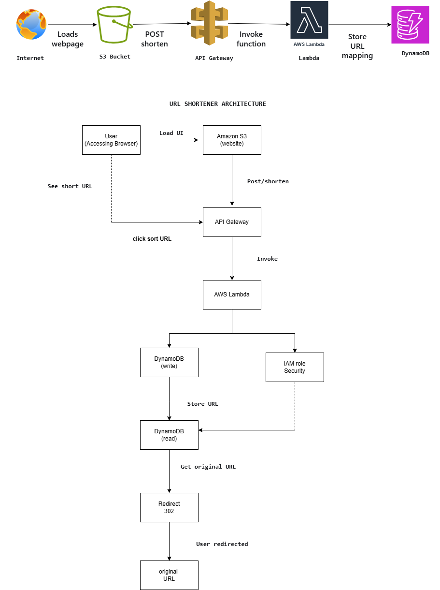

AWS Serverless URL Shortener
1) What It Does (User Flow)

This is a URL shortener built on AWS. Users can shorten long URLs and use short links to redirect to the original URLs.

Write Path (Create Short URL):

User submits URL → API Gateway → Lambda → DynamoDB → Returns short code

Read Path (Redirect):

User clicks short link → API Gateway → Lambda → Looks up URL in DynamoDB → 302 redirect

2) Architecture

Or resize if needed:

Components:

Frontend: S3 static website

API: API Gateway

Compute: AWS Lambda (Python)

Database: DynamoDB

IaC: AWS SAM template

Security:

Least-privilege IAM roles

No hardcoded secrets (environment variables only)

3) API Endpoints

Shorten URL (POST):

curl -X POST https://th1omwipo7.execute-api.us-east-1.amazonaws.com/prod/shorten \
  -H "Content-Type: application/json" \
  -d '{"long_url":"https://example.com"}'

Example Response:

{
  "short_code": "abc123",
  "short_url": "https://th1omwipo7.execute-api.us-east-1.amazonaws.com/prod/abc123",
  "original_url": "https://example.com"
}

Redirect (GET):

curl -I https://th1omwipo7.execute-api.us-east-1.amazonaws.com/prod/abc123

4) SLO & Monitoring Plan

p95 latency: < 300ms

Error rate: < 1%

Availability: > 99%

Monitored Metrics:

Lambda errors

API Gateway 4xx/5xx

DynamoDB read/write latency

Request rates

Refer to monitoring_plan.md for detailed monitoring instructions.

5) How to Deploy
git clone https://github.com/vamsireddy1998/Final_Project_Group
cd Final_Project_Group
sam build
sam deploy --guided

Access URLs:

Web Frontend: http://final-project-vvs.s3-website-us-east-1.amazonaws.com

API: https://th1omwipo7.execute-api.us-east-1.amazonaws.com/prod

6) Team & Roles
Team Member	Role
Name1	AWS Infrastructure
Name2	Lambda & Database
Name3	Frontend & Documentation

Replace Name1, Name2, Name3 with actual team member names.

7) AI Usage

Tools: ChatGPT-4, GitHub Copilot

Prompt Example: "Generate Python Lambda for URL shortener with DynamoDB"

Human Modifications:

Added security measures

Implemented input validation

Set up monitoring & alerting

Ensured production readiness

Features Implemented:

Infrastructure as Code (AWS SAM)

Lambda functions for URL creation and redirection

Static frontend hosted on S3

CloudWatch monitoring and alarms

IAM roles with least privilege

8) Screenshots / Evidence (Optional)

Include any of the following as needed for submission:

CloudWatch Logs: Lambda invocations and errors

curl outputs: Show POST response and GET redirect

Browser redirect screenshots: Demonstrate redirection to the original URL

✅ All sections included
✅ Properly formatted code blocks
✅ Architecture diagram placeholder ready
✅ Team names placeholders ready
